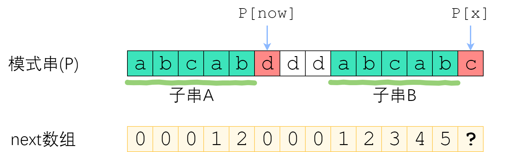

1. 快慢指针找环入口：
   设head到环入口的距离为a，快慢指针相遇的点距环入口距离为b，环的长度为L。  
   **注**：快慢指针相遇时，慢指针所走的路程a+b。  
   2*(a+b) = a+b+n*L  
   a = n*L - b  
   因此，fast此时再走a距离，即2a+b+n*L = a + 2n*L，也就是此时fast位于环入口处。  
   所有创建一个指针指向head，和fast一起往后走，他们相遇时即为环入口。

2. priority_queue优先队列：默认为大顶堆  
   小顶堆写法示例：priority_queue<int, vector<int>, greater<int>>。
   - push/pop(): o(log n) 
   - top(): o(1)
   - 第一个非叶结点下标：length / 2 - 1
   - 左孩子下标：2 * i + 1
   - 右孩子下标：2 * i + 2
   - 父亲下标：（i - 1）/ 2   
  将原有数组原地建大顶堆：从第一个非叶结点开始每个节点都做下沉，即与左右孩子比较、交换并递归做交换的结点。  
  取堆顶： 将堆顶与最后一个元素交换，然后下沉堆顶。  
  因此，将下沉操作写成函数如下：
  ``` c++
  void BuildMaxPile(vector<int>& nums, int i){//下沉
      int largest = i, left = i*2+1, right = left + 1;

      if(left < nums.size() && nums[left] > nums[largest]){
         largest = left;
      }

      if(right < nums.size() && nums[right] > nums[largest]){
         largest = right;
      }
      
      if(largest != i){//如果i是最大的，直接返回，否则交换nums[i]和最大的，并继续下沉
         swap(nums[i], nums[largest]);
         BuildMaxPile(nums, largest);
      }
      return;
   }
   ``` 
3. 单调栈：栈内元素或以元素为下标的值单调递增或递减，即入栈操作不破坏栈的单调性。用于解决找最近一个比当前元素大或小的元素。
4. 升序合并两个有序链表的函数：
- new一个结点，用它的next保存合并后的头。
- 用last保存已合并的末尾。
- 若两个链表都存在，就比较大小，并把小的放在last的后面，并更新last。
- 若有一个链表空了，直接把另一个接在last后面。
5. delete操作会释放指针所指向的内存，并调用该内存中对象的析构函数，需要手动将指针置为NULL。
6. 空指针实际上存储了一个特殊的值，表示它不指向任何有效的内存地址。所以不能对空指针进行解引用，因为不存在这样的地址。
7. - 空悬指针：指向已释放的内存地址的指针。
   - 野指针：未初始化的指针，指向一个随机值。
8. 任何一个正整数都可以表示成不超过四个整数的平方之和
9. 可用pair<T1,T2>(x,y)或make_pair(x,y)来创建一个pair。

``` C++
auto pair1 = pair<int, int>(1,2);
auto pair2 = make_pair("abc", 2);
//pair1.first = 1;
//pair2.second = 2; 
```
10.  priority_queue里面放pair，默认用pair.first来比较大小。
11. 字符串匹配——KMP算法：  
    参考：[https://www.zhihu.com/question/21923021](https://www.zhihu.com/question/21923021)  
      
    求next数组：  
    next[x] 定义为： P[0]~P[x] 这一段字符串，使得k-前缀恰等于k-后缀的最大的k.
    - 当p[i + 1] == p[x + 1],next[i + 1] = next[i] + 1;  
    - 当p[i + 1] != p[x + 1].
  > 求使得 A的k-前缀等于B的k-后缀 的最大的k。串A和串B是相同的！B的后缀等于A的后缀！因此，使得A的k-前缀等于B的k-后缀的最大的k，其实就是串A的最长公共前后缀的长度 —— next[now-1]！
  ``` C++
  class Solution {
public:
    //部分匹配表
    void matchForm(string needle,vector<int>& next){
        int k = 0;//模式串下标
        for(int i = 1; i < needle.size(); i++){//i为next数组下标
            while(k > 0 && needle[k] != needle[i]){
                k = next[k - 1];
            }
            if(needle[k] == needle[i]){
                next[i] = k + 1;
                k++;
            }
            if(k == 0){
                next[i] = 0;
            }
        }
        return;
    }
    int strStr(string haystack, string needle) {
        vector<int> next(needle.size(), 0);
        matchForm(needle, next);
        int i = 0, j = 0;//i表示haystack正在比较的下标；j是neddle上的
        for(; j < needle.size() && i < haystack.size();){
            if(haystack[i] == needle[j]){
                j++;
                i++;
            }else if(j == 0){
                i++;
            }else{
                j = next[j - 1];
            }
        }
        if(j == needle.size()){
            return i - j;
        }else{
            return -1;
        }
        
    }
};
```
